  
  

---

## `$ whoami`

  

## `$ ./estado --actual`

  

## `$ cat tech-stack.yaml`

  

## `$ ls -la proyectos/`

  

## `$ git log --oneline --graph`

  

## `$ connect --contacto`

Hecho con ⚡ y mucho café desde Lima, Perú · <code>@oscarjscom</code>

